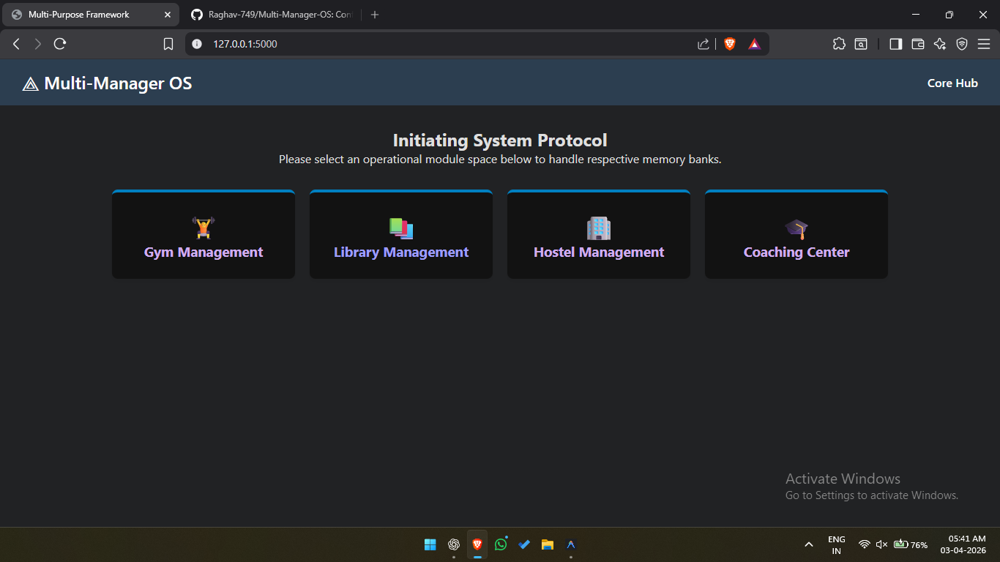
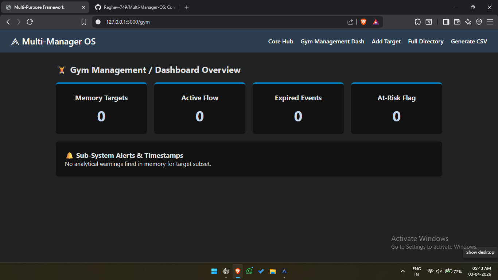
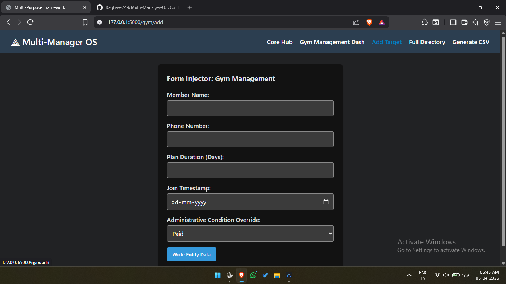

# Multi-Manager-OS

## Overview

A configurable management system that can be used for Gym, Library, Hostel, or other use cases by changing the data structure.

## Features

* Add, Update, Delete, Search records
* Dynamic fields (config-based system)
* JSON storage
* CSV export
* Backup system
* Web interface using Flask

## How to Run

1. Install Python
2. Install dependencies:
   pip install flask
3. Run the app:
   python app.py
4. Open in browser:
   http://127.0.0.1:5000

## Tech Stack

* Python
* Flask
* HTML/CSS
* JSON

## Screenshots

## Live Demo
Coming soon...
